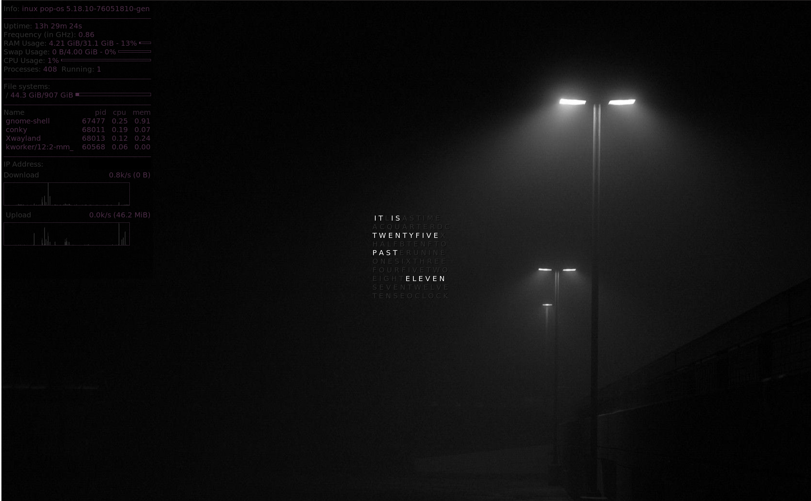

WIP Linux Conky desktop theme

This is a WIP Conky theme for linux desktop
Config is written lua 

---

Prerequesites:

- [conky](https://github.com/brndnmtthws/conky/)
- a way of running scripts at startup (this varies from distro to distro)

---

The conkystart.sh script scans the directory for any file prefixed with .conkyrc
This means you can run multiple conky instances like in the example image below where I have mowgli-writes' [qlocktwo](https://www.deviantart.com/mowgli-writes/art/qlocktwo-conky-470067388) alongside a basic stats monitor. This way you can keep adding conkyrc files and keep them nice and separated. It would be nice if you could pass multiple files to conky but as far as I'm aware it's not possible. This is a nice workaround. 

---

